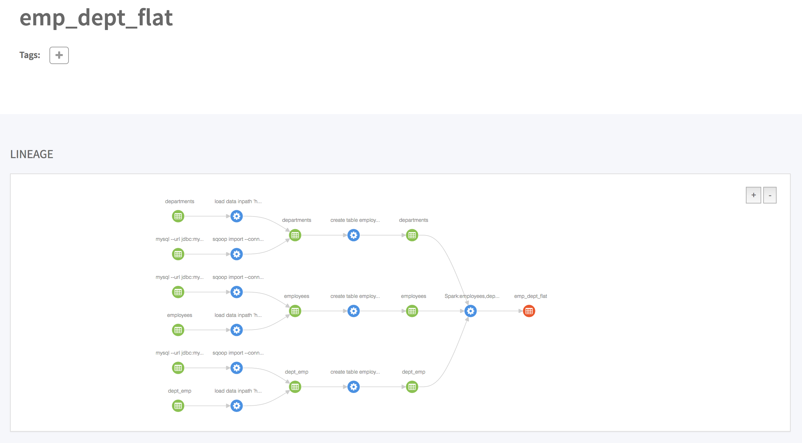
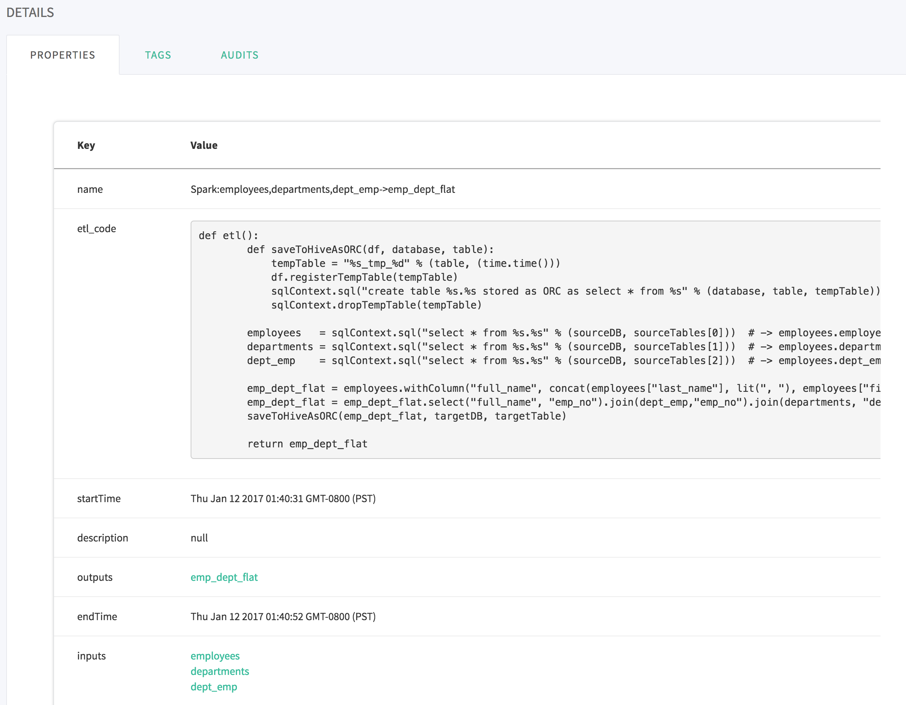

## Usage

1) Add Atlas URL and credentials

```bash
#
# Atlas Config
#
cluster   = "Sandbox"
atlasHost = "localhost:21000"
user      = "holger_gov"
password  = "holger_gov"
```

2) Add some Metadata decribing the ETL job

```bash
#
# (1) Metadata for the etl job
#
sourceDB          = "employees"
sourceTables      = ("employees", "departments", "dept_emp")

targetDB          = "default"
targetTable       = "emp_dept_flat"
targetColumns     = ["dept_no:string", "emp_no:int", "full_name:string", "from_date:string", "to_date:string", "dept_name:string"]

usedSparkPackages = []
owner = "etl"
```

3) Create a function etl that holds all ETL code that should be copied into Atlas as description of transformantion. Use Metadata to avoid inconsistencies

```bash
#
# (2) This is the actual ETL Spark function and its source will be copied into ATLAS Lineage. 
#
def etl():
	def saveToHiveAsORC(df, database, table):
	    tempTable = "%s_tmp_%d" % (table, (time.time()))
	    df.registerTempTable(tempTable)
	    sqlContext.sql("create table %s.%s stored as ORC as select * from %s" % (database, table, tempTable))
	    sqlContext.dropTempTable(tempTable)

	employees   = sqlContext.sql("select * from %s.%s" % (sourceDB, sourceTables[0]))  # -> employees.employees
	departments = sqlContext.sql("select * from %s.%s" % (sourceDB, sourceTables[1]))  # -> employees.departments
	dept_emp    = sqlContext.sql("select * from %s.%s" % (sourceDB, sourceTables[2]))  # -> employees.dept_emp

	emp_dept_flat = employees.withColumn("full_name", concat(employees["last_name"], lit(", "), employees["first_name"]))
	emp_dept_flat = emp_dept_flat.select("full_name", "emp_no").join(dept_emp,"emp_no").join(departments, "dept_no")
	saveToHiveAsORC(emp_dept_flat, targetDB, targetTable)

	return emp_dept_flat
```

Rest see [spark-etl.py](spark-etl.py)


## Result:

1) Lineage Graph


2) ETL Process properties


